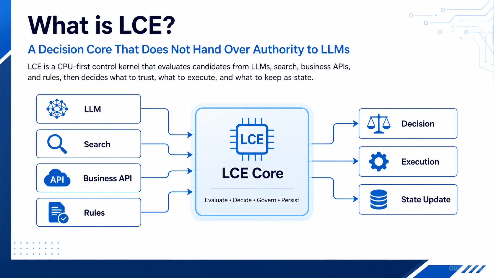

# LCE: Lightweight Cognitive Engine

> LLM、検索、API、ルールベース処理の候補を評価し、判断を引き受けるCPUファーストの制御・保証レイヤー。

[English](README.md) | [最短実行](QUICKSTART.md) | [pipで導入](PIP_INSTALL.md) | [API](API.md) | [現在の状態](CURRENT_STATUS.md)



## LCEとは

LCEは言語モデルではなく、Transformerの代替を目指すものでもありません。LLM、検索、業務API、センサー、ルールエンジンなどが出した**候補**を、アプリケーションが次の行為へ進む前に評価する、小さく検査可能な制御レイヤーです。

自然な文章や有効なJSONが返っても、それだけでは外部処理を実行してよいとは限りません。形式、宣言済み根拠、許可された操作範囲、状態更新との整合性を明示的に確認し、LCEは限定された判断を返します。

```text
入力
  -> アプリケーションがLLM・検索・API・ルール処理を選択
  -> 選択された処理が候補を返す
  -> LCEが契約、根拠、権限、状態境界を検査
  -> ACCEPT / RETURN_TO_MODEL / HOLD または型付きの保証判断
  -> 再試行、外部実行、状態確定はアプリケーションが所有
```

LCE自身がモデル生成、ツール実行、権限昇格、データベース書き込みを黙って引き受けることはありません。この責任分離が中心です。

## なぜLLMとアクションの間に置くのか

制御レイヤーがない場合、アプリケーション側にはモデルごとの条件分岐が積み上がりがちです。モデルの選択、RAGの必要性、JSON検証、根拠不足の停止、操作範囲の制限、受理理由の記録などです。LCEは、こうした**限定できる判断**を版管理可能なデータ契約と追跡可能なゲートへ寄せます。

次の問いが重要なときに使えます。

- 次の処理が期待するJSON契約を満たしているか。
- `known` とする主張は宣言した根拠参照に支えられているか。
- 候補は要求されたアクション範囲へ影響してよいか。
- 必須クロスチェックが受理済み結果と矛盾していないか。
- なぜ受理・保留・差し戻しになったかを後から再生できるか。

## コアが担うこと

| 領域 | LCEが担うこと | 担わないこと |
|---|---|---|
| 構造化出力 | JSON解析、小さく検査可能なスキーマ検証、安全な既定値、修復指示の返却 | 有効なJSONが真実・有用であることの証明 |
| 宣言済み保証 | 必須値・用語・根拠参照・certainty規則・禁止用語の検査 | 一般的な意図や現実世界の真偽の推論 |
| 候補保証 | provenance、confidence、権限、アクション範囲の検査 | 候補の実行 |
| 受理の再審議 | 必須クロスチェックや根拠信号が失敗した受理結果の差し止め | 人間レビューの置換 |
| 状態とトレース | 状態更新の境界、決定論的なトレースと再生 | 無制限な長期記憶 |
| Pack/Profile | データとしての言語・方針・モデルプロファイルの読み込みとハッシュ固定 | Coreを迂回する実行可能プラグイン |

## 典型的な統合

ローカルHTTP Control APIは意図的に小さく作っています。アプリケーションが候補生成を行い、その候補をLCEに送り、返ってきた判断を見て次の行為を決めます。

```text
application -> local LLM / RAG / business API -> LCE Control API -> application
```

構造化出力では、呼び出し元が `raw_output` と契約を
`POST /v1/gate/structured-output` へ渡します。

- **ACCEPT**: 検証済みの `result.value` を利用する。
- **RETURN_TO_MODEL**: 限定された修復指示を生成元へ返し、次の候補を再送する。
- **HOLD**: 根拠取得または宣言済み方針の解決まで外部行為を止める。

API自身はLLM呼び出し、Web検索、ツール実行、状態確定をしません。そのため、ローカルLLM、フロンティアモデルAPI、非言語サービス、決定論的プログラムのいずれにも挟めます。詳細は [API.md](API.md) にあります。

## 導入と最小実行

Python 3.11以上が必要です。PyPI公開前のalpha版はGitHubから直接導入できます。

```powershell
python -m pip install "lce-open-core @ git+https://github.com/UtakataService/LCE.git@v0.1.0-alpha.1"
lce --help
lce-api --host 127.0.0.1 --port 8789
```

Release wheelと開発用editable導入は [PIP_INSTALL.md](PIP_INSTALL.md) を参照してください。

モデルやネットワークに依存しない参照例:

```powershell
python examples\quickstart_open_core.py
python examples\reference_assurance_gateway.py
```

ローカルAPIの例:

```powershell
python -m lce_validation.api_server --host 127.0.0.1 --port 8789
python examples\api_client_demo.py --base-url http://127.0.0.1:8789
```

任意のOllama参照では `gemma4:e4b` を使えます。1ケースにつきモデルを1度だけ呼び、その**同じ生出力**を `lm_only` と `lm_with_lce` で評価します。

```powershell
python examples\gemma4_e4b_reference_demo.py --out gemma4-e4b-reference.json
```

これは構造化出力統合の確認であり、会話品質や事実性のベンチマークではありません。詳細は [GEMMA4_E4B_REFERENCE.md](GEMMA4_E4B_REFERENCE.md) を参照してください。

## LCEが主張しないこと

LCEは意図的に対象を絞っています。汎用対話品質、事実正確性、20B級単体性能、一般的な安全性モデレーション、自律ツール実行、公開ネットワークサービス、任意プラグイン実行、固定fixtureからの一般化は主張しません。

証跡は記載された契約とfixtureの範囲に限定されます。結果を読む前に [CURRENT_STATUS.md](CURRENT_STATUS.md) と [EVALUATION_POLICY.md](EVALUATION_POLICY.md) を確認してください。

## 状態・資料・ライセンス

公開alphaは **Experimental Open Core + Reference Pack + Reference Assurance Gateway** です。ローカルAPI、再現可能な参照パス、版管理済みGemma統合、メタデータのみの独立holdout計画、公開回帰証跡を含みますが、実験段階です。

- [最短実行](QUICKSTART.md)、[全体像](OVERVIEW.md)、[現在の状態](CURRENT_STATUS.md)
- [評価方針](EVALUATION_POLICY.md) と [独立holdout計画](EVALUATION_HOLDOUT_PLAN.md)
- [Pack信頼境界](PACK_TRUST.md)、[貢献方法](CONTRIBUTING.md)、[セキュリティ](SECURITY.md)、[サポート](SUPPORT.md)

LCEはソース公開型ライセンスです。個人としての利用には広範な権利を認め、法人・団体としての利用には事前の書面承認が必要です。OSI準拠のOSSライセンスではありません。詳細は [LICENSE](LICENSE)、[LICENSE_POLICY.md](LICENSE_POLICY.md)、[ORGANIZATIONAL_USE.md](ORGANIZATIONAL_USE.md) を参照してください。
